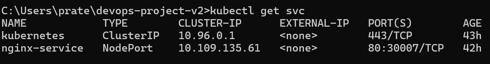

# 🚀 Kubernetes Nginx Deployment Project

## 📌 Project Overview

This project demonstrates how to deploy a containerized application using Kubernetes. It uses Nginx as a sample application and exposes it using a NodePort service.

---

## 🛠️ Tech Stack

* Docker
* Kubernetes
* Git & GitHub

---

## 📂 Project Structure

```
devops-project-v2/
│── k8s/
│   │── deployment.yaml
│   │── service.yaml
│── screenshots/
│── README.md
```

---

## ⚙️ Setup Instructions

### 1️⃣ Clone Repository

git clone https://github.com/prateek-dev26/devops-project-v2.git

### 2️⃣ Move into Folder

cd devops-project-v2

### 3️⃣ Deploy to Kubernetes

kubectl apply -f k8s/

### 4️⃣ Check Resources

kubectl get pods
kubectl get svc

---

## 📸 Screenshots

## 📸 Screenshots

### Pods Running


### Service Output


---

## 📊 Features

* Nginx deployed on Kubernetes
* Multiple replicas for scalability
* NodePort service for external access

---

## 🌐 Output

The application can be accessed in the browser using Minikube service:
minikube service nginx-service

---

## 🙌 Author

Prateek Vishwakarma
Aspiring DevOps Engineer 🚀
